Automated Meter Reading System For Efficient Electricity Monitoring

Project Description
The Automated Meter Reading System is an IoT-based smart electricity monitoring system developed using ESP8266 and Django. The system helps in real-time electricity monitoring, automated bill generation, complaint management, and efficient electricity distribution management.


Features
- Real-time electricity monitoring
- Automated meter reading
- Bill generation and payment management
- Complaint management system
- Admin, Consumer, and Employee modules
- Zone-based electricity management
- New electricity connection requests
- Usage history and bill history
- Accurate electricity bill calculation


Technologies Used
- Python
- Django
- HTML
- CSS
- JavaScript
- SQLite / MySQL
- ESP8266
- IoT Sensors


Modules

Admin Module
- Manage consumers and employees
- Generate electricity bills
- Monitor electricity usage
- Manage zones and alerts

Consumer Module
- View electricity usage
- Pay bills
- Register complaints
- Apply for new connections

Employee Module
- View assigned tasks
- Update maintenance status
- Resolve complaints


How to Run the Project

1. Clone the repository
2. Open project in VS Code
3. Install requirements

```bash
pip install -r requirements.txt

4. Run migrations

```bash
python manage.py migrate
```

5. Start the server

```bash
python manage.py runserver
```

6. Open browser and visit

http://127.0.0.1:8000/

---

Screenshots

### Login Page
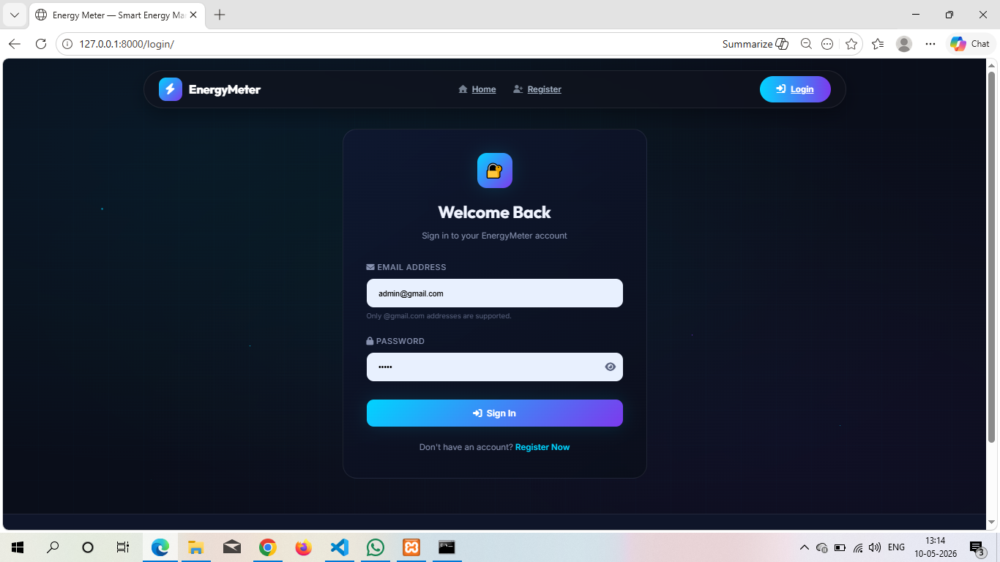

---

## Admin Dashboard

### Dashboard
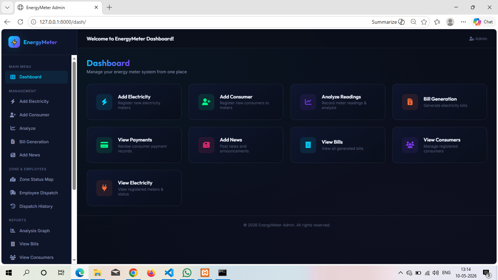

### Add News
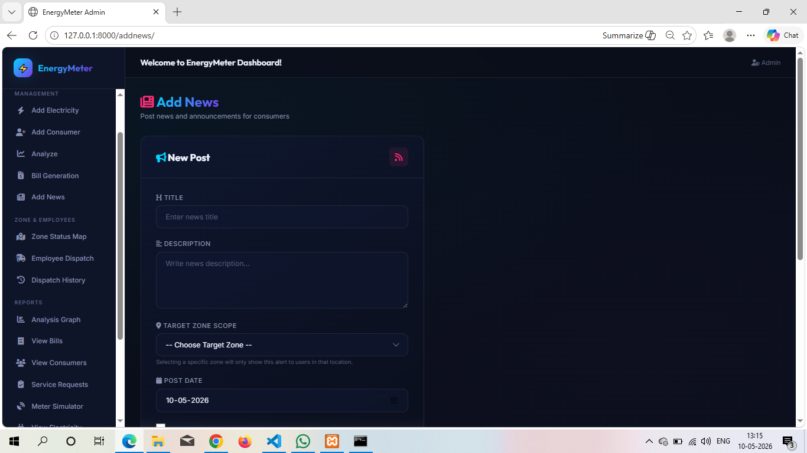

### Analysis Chart
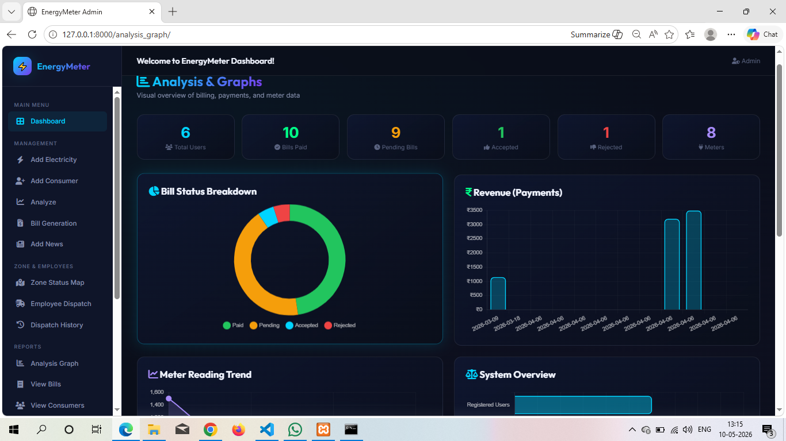

### Dispatch Employee
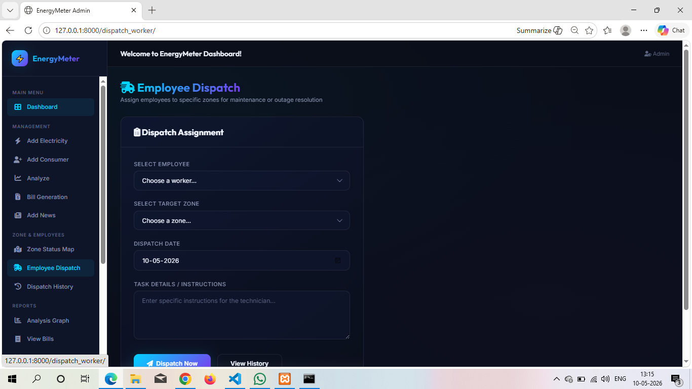

### Generate Bill
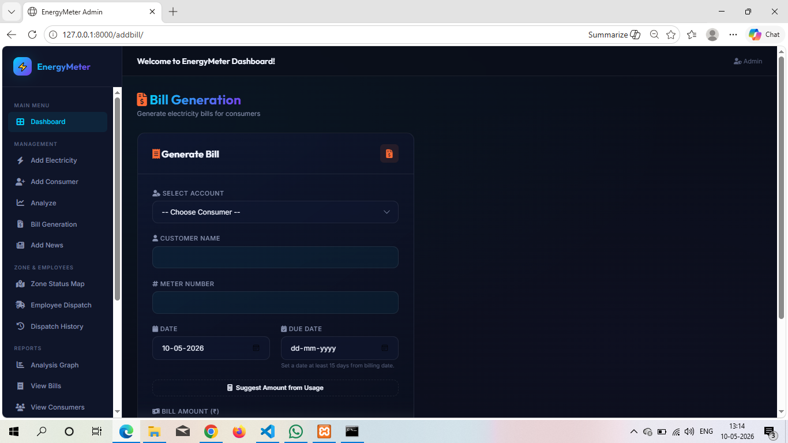

### Manage Requests
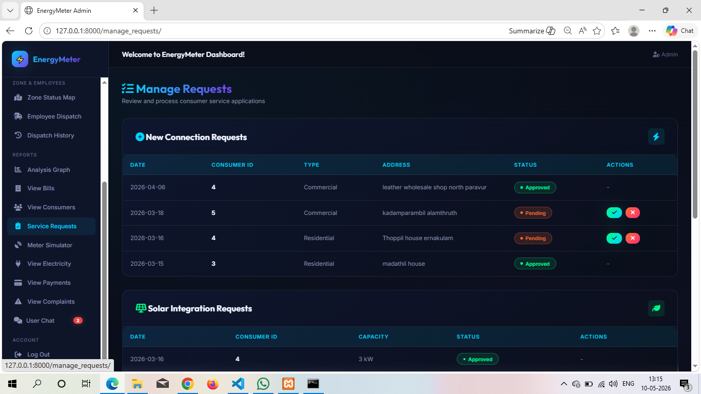

### View Bills
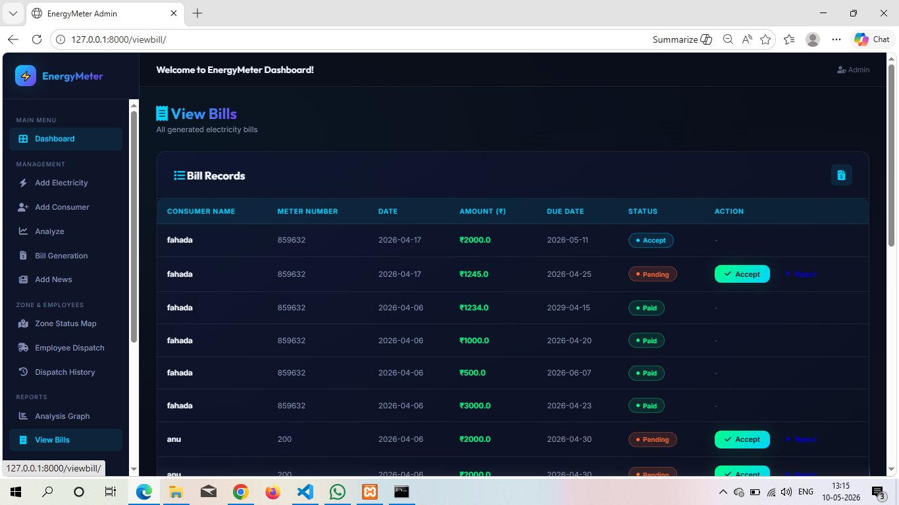

---

## Consumer Dashboard

### Consumer Dashboard
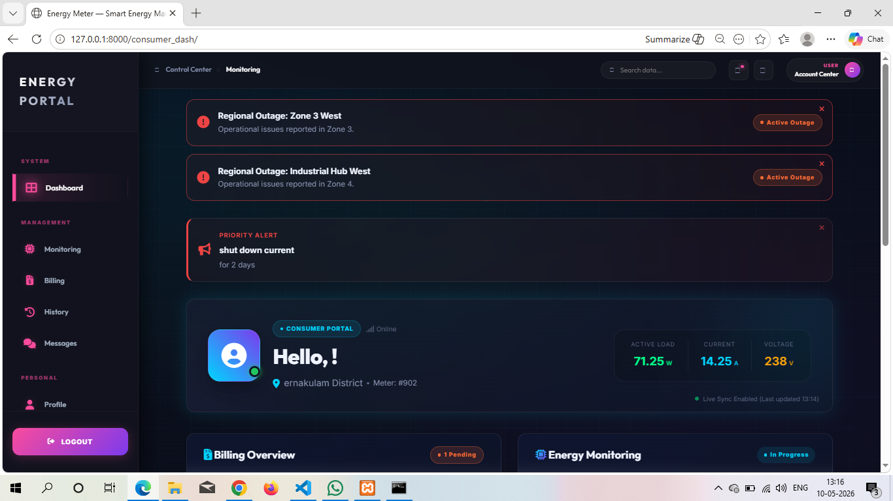

### Consumer Bills
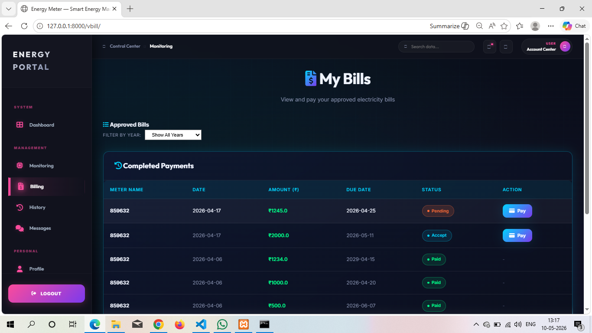

### Complaint Page
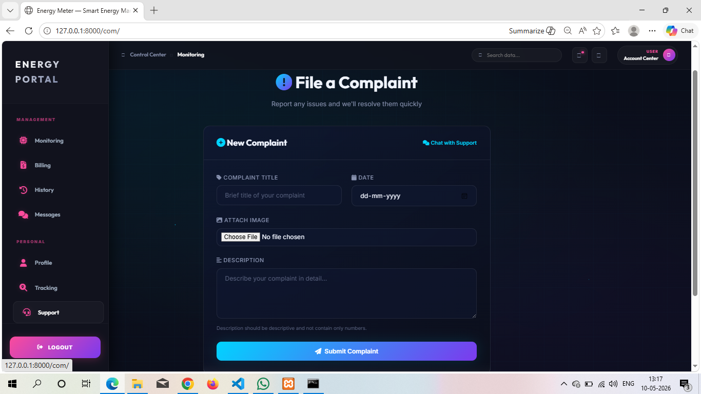

### Energy Monitoring
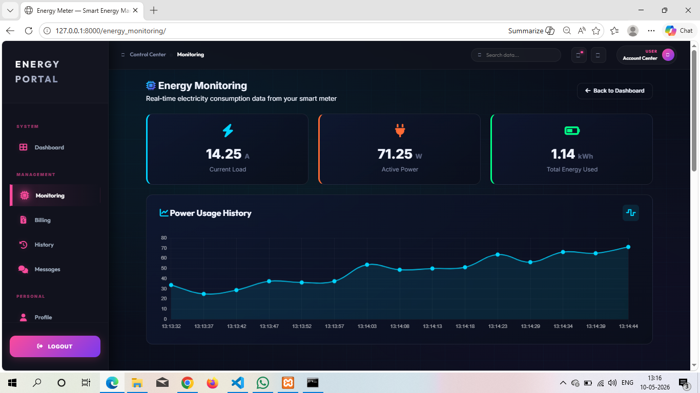

---

## Employee Dashboard

### Employee Dashboard
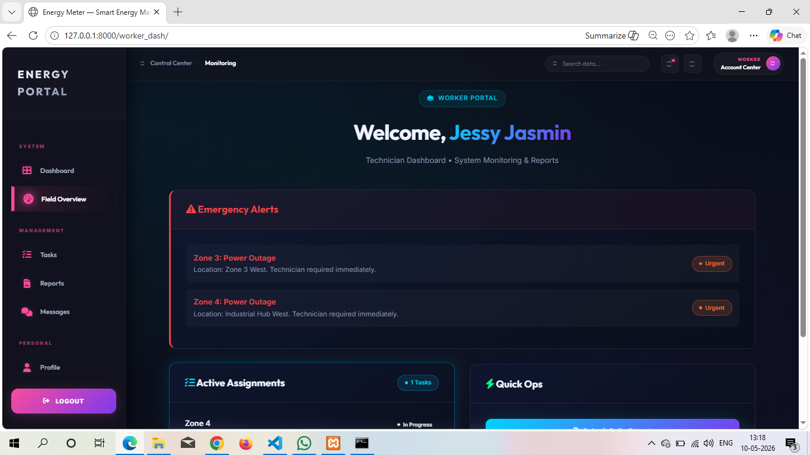

### Task List
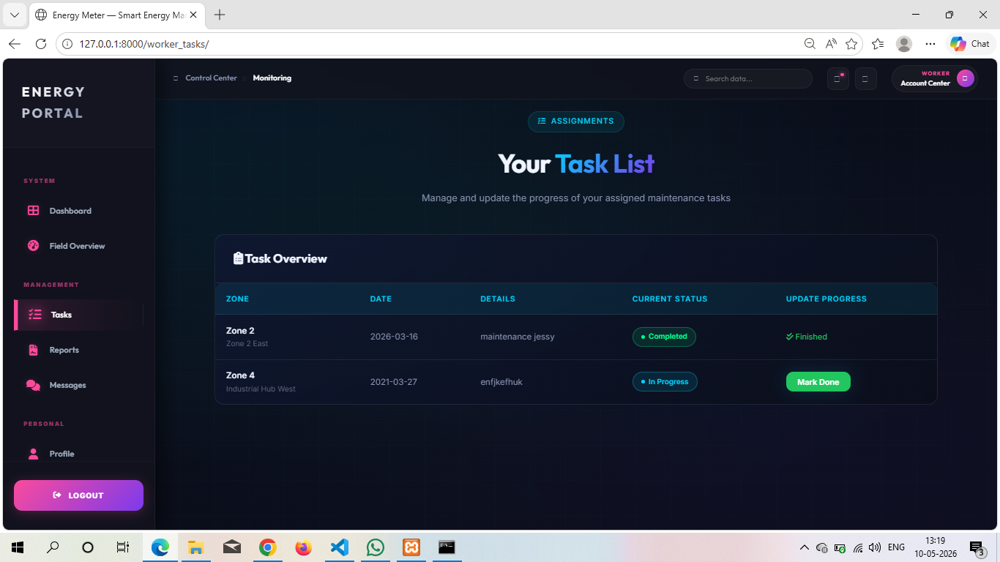
---

## 📄 License
This project is developed for educational purposes.